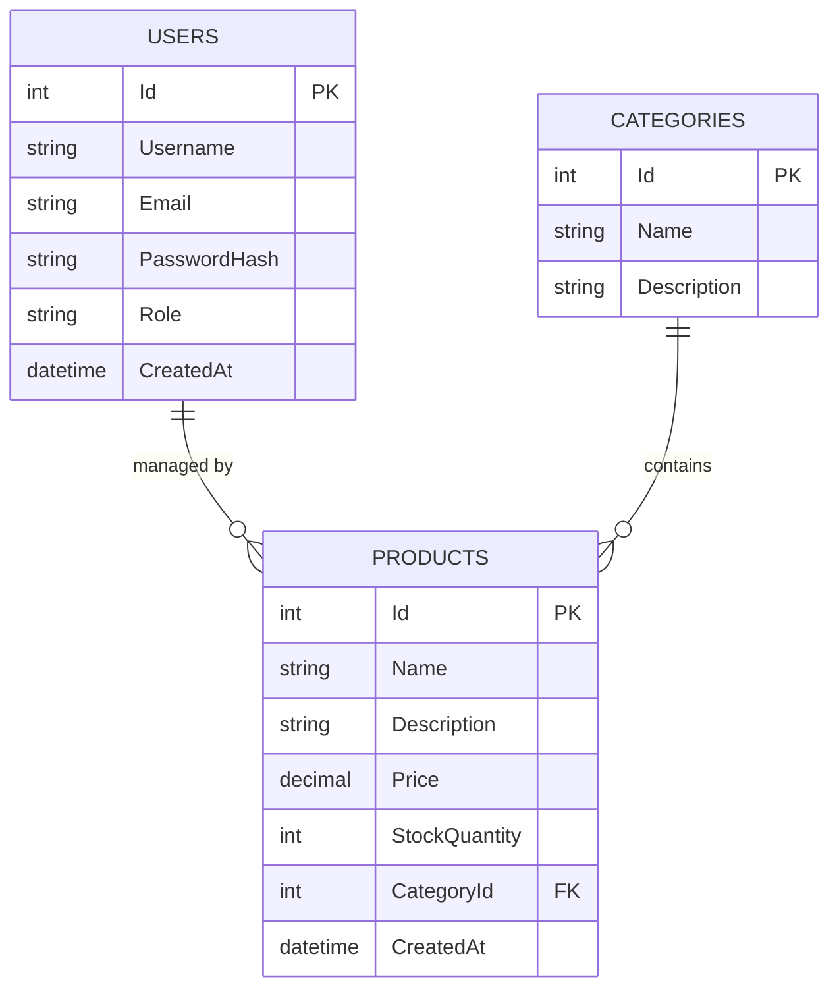

# MySQL Database Implementation Plan

## 1. Overview & Technology Stack

The database tier is powered by **MySQL 8.0**, providing a robust relational storage foundation for the .NET API backend, Next.js frontend, and Vue.js admin panel.

- **Database Engine**: MySQL 8.0 Containerized
- **Default Database Name**: `proj2_db`
- **Default Port**: `3306`
- **ORM / Migrations**: Entity Framework Core (`Pomelo.EntityFrameworkCore.MySql`)
- **Initialization Script**: `database/init.sql`

---

## 2. Database Schema Design



---

## 3. Implementation Phases Roadmap

### Phase 1: Database Schema & Script Design
- Create `database/init.sql` script with table definitions:
  - `Users` table (Id, Username, Email, PasswordHash, Role, CreatedAt).
  - `Categories` table (Id, Name, Description).
  - `Products` table (Id, Name, Description, Price, StockQuantity, CategoryId, CreatedAt).
- Insert initial seed records for testing (default admin user, sample product categories, sample products).

### Phase 2: Docker Compose Configuration
- Setup `docker-compose.yml` defining `mysql` service:
  ```yaml
  services:
    mysql:
      image: mysql:8.0
      container_name: proj2_mysql
      environment:
        MYSQL_ROOT_PASSWORD: rootpassword
        MYSQL_DATABASE: proj2_db
      ports:
        - "3306:3306"
      volumes:
        - mysql_data:/var/lib/mysql
        - ./database/init.sql:/docker-entrypoint-initdb.d/init.sql
  ```
- Configure health check on MySQL service to ensure container readiness before dependent services (.NET API) start.

### Phase 3: EF Core Integration & Migrations
- Define MySQL connection string in .NET API `appsettings.json`.
- Execute EF Core commands for schema management:
  - `dotnet ef migrations add InitialCreate`
  - `dotnet ef database update`

### Phase 4: Backup, Indexing & Optimization
- Add indexes on frequently queried columns (`Products.CategoryId`, `Users.Email`).
- Create backup and restoration documentation for environment migrations.
